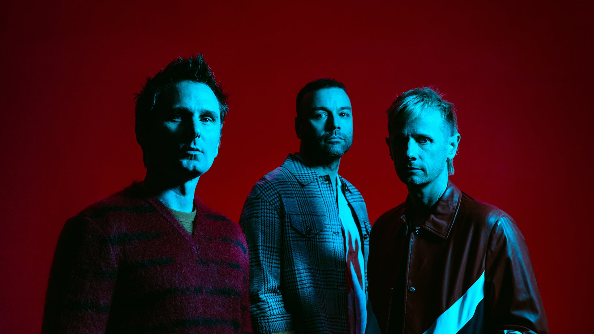

<html lang="ko">
<head>
    <meta charset="UTF-8">
    <meta http-equiv="X-UA-Compatible" content="IE=edge">
    <meta name="viewport" content="width=device-width, initial-scale=1.0">
    <title>20170976 심원준의 홈페이지</title>
    
        
</head>
<body>
    <ul>
        <li><a href="./showbiz.html">1st Album</a></li>
        <li><a href="./Origin of Symmetry.html">2nd Album</a></li>
        <li><a href="./Absolution.html">3rd Album</a></li>
        <li><a href="./blackholes and revelations.html">4th Album</a></li>
        <li><a href="./The resistance.html">5th Album</a></li>
        <li><a href="./The 2nd law.html">6th Album</a></li>
        <li><a href="./Drones.html">7th Album</a></li>
        <li><a href="./Simulation Theory.html">8th Album</a></li>
        <li><a href="./Will of the people.html">9th Album</a></li>
      </ul>
    <h1 style="color:purple;">'Muse'를 아시나요?</h1>
    
    <h2 style="color:red;">Member List(왼쪽순으로)</h2>
    <table style="width:70%">
      <tr>
        <th>멤버</th>
        <th>생년월일</th> 
        <th>포지션</th>
      </tr>
      <tr>
        <td>메튜 벨라미(Matthew Bellamy)</td>
        <td>1978년 06월 09일</td>
        <td>리드보컬, 기타, 키보드, 신디사이저, 솔더 키보드</td>
      </tr>
      <tr>
        <td>크리스 볼첸홈(Chris Wolstenholme)</td>
        <td>1978년 12월 02일</td>
        <td>베이스, 백업보컬, 리드보컬, 기타, 키보드, 하모니카</td>
      </tr>
      <tr>
        <td>도미닉 하워드(Dominic Howard)</td>
        <td>1977년 12월 07일</td>
        <td>드럼 및 퍼커션, 신시사이저, 백업보컬</td>
      </tr>
    </table>
  

      <h2 style="color:royalblue;">영국 대표 락밴드 'Muse'</h2>
      
      <map name="muselogo">
        <area shape="circle" coords="155,155,155" alt="muselogo" href="https://www.muse.mu/?frontpage=true">
      </map>
      
<i>★로고 클릭시 공식홈페이지로 들어가진다.★</i>

      
1994년 결성된 영국의 3인조 락밴드이다.

        
대표적인 장르는 '얼터너티브 락'으로, '얼터너티브 락'이란 1990년대 말에 기존 록 음악의 평범한 구성 방식에서 탈피한 락밴드들이 등장하면서 인기를 끌게 되었다. 최근에는 기존의 메탈적 성향을 벗어난 모든 락음악을 지칭하는 용어로도 쓰이고 있다.
         최근에는 브릿팝에 자신들만의 하드락 감성을 접목시키는 음악을 하고있다.

        
최근까지 총 8개의 정규엘범을 냈으며, 2022년 8월 26일 <em>'Will of the People'</em>라는 9집 정규엘범을 낼 예정이다.

        
또한 해외 정상급 아티스트 중 'Maroon5'와 함께 내한 공연횟수가 굉장히 많은 편에 속한다.(6번) 한국에서 열리는 락 페스티벌의 단골 손님이기도 하다.

      
대표적인 곡으로는 'Time is running out', 'Plug in baby', 'New born', 'Supermassive and Blackhole', 'Uprising'등이 있다.

      <h2 style="color:mediumseagreen;">음악적 특성</h2>
      
<mark>음악적 스타일이 초창기에는 '라디오헤드'의 초기 음악과 매우 유사해 카피 밴드 아니냐는 반응이 많았다.</mark> 초창기 창법이 '톰 요크'와 비슷한 데다, 라디오헤드 2집 The Bends의 프로듀서 '존 레키(John Leckie)'가 뮤즈 1집 Showbiz와 2집 Origin of Symmetry의 프로듀싱에 참여하기도 했기에 그런 이미지가 더 증폭되기도 했다. 그러나 앨범을 거듭할수록 밴드만의 색깔을 찾아가며 논란을 불식시켰고, 전형적인 영국식 얼터너티브 록에서 여러 가지 장르를 뒤섞은 프로그레시브 록으로 변화를 모색했다. 물론 그렇다고 해서 '핑크 플로이드'같은 느낌을 기대하면 안 된다. 정확하게 얘기하면 1970~80년대 프로그레시브 록과는 거리가 있다(매튜는 그런 프로그레시브 록을 좋아하지 않는다고 밝힌 적 있다).

      
여러 가지 스타일의 음악을 구사하기 때문에 장르 분류가 모호하다. 보통은 얼터너티브 록, 모던 록으로 분류되는 편이고, 사이키델릭한 느낌, 프로그레시브한 느낌과 그런지한 느낌도 갖고 있다. 참고로 영문 위키에선 얼터너티브 락, 스페이스 락, 심포닉 락, 프로그레시브 메탈, 뉴 프로그로 분류. 기본적으로는 정통 록을 기반으로 일렉트로닉부터 클래식에 이르기까지 매우 다양한 음악적 스펙트럼을 시도한다고 말할 수 있다.

      
초기에는 라디오헤디즘의 우울함을 라흐마니노프 같은 낭만주의 클래식과 섞고, 이를 하드록-헤비메탈-사이키델릭 텍스처로 표현하여 록킹함과 극적인 느낌을 극대화한 음악이었다. 이런 음악적 아이덴티티가 가장 잘 나타난 앨범이 2집이었고, 때문에 2집은 평론가들과 '뮤즈'의 팬들에게 '뮤즈'의 최고 명반으로 꼽히고 있다. 그리고 이런 경향을 3집까지 가져왔지만 <mark>본격적으로 상업적 도약을 시작했던 4집부터 '퀸'의 오페라 록을 받아들이면서부터 호불호가 갈리기 시작했다. 간단히 말하자면 각 장르들의 특징들만을 저마다 가져와서 본인 나름대로 잘 섞은 음악을 들려주는 밴드이다.</mark> 그래서 안티들은 '뮤즈'를 근본도 없는놈들이라 까기도 한다.

      
'크리스'의 베이스와 '도미닉'의 드럼이 깔아주는 튼튼하고 캐치한 리듬 섹션 위에서 사납게 날뛰는 '매튜 벨라미'의 보컬이 유명하다. 세련된 저음부터 히스테릭한 가성, 그리고 알 수없는 괴성까지 자유자재로 뿜어내는 매튜는 특유의 트리오 편성과 함께 '뮤즈'의 아이덴티티로 꼽히곤 한다.

      
<mark>가사가 심히 난해하고 거의 내용이 시궁창이다.</mark> 이는 가사를 쓰는 '매튜 벨라미'가 음모론, 외계인, 우주 등에 관심이 많기 때문인데 그냥 가사 해석본을 봐서는 알 수 없고 곡에 대한 인터뷰나 자료를 찾아봐도 알 수 없다. 가장 유명한 곡들 중 하나인 'Plug In Baby'만 보아도 신성모독, 검열삭제, 기계화된 현대 문명에 대한 비판, 기타에 대한 사랑 혹은 어장관리로 실연당한 남자가 기타로 사랑을 잊겠다는 내용 등 천차만별로 갈린다('MK Ultra'도 미국 비밀 실험에 대한 이야기이며 웸블리 라이브 앨범인 'H.A.A.R.P'도 기후조작비밀실험인 HAARP에서 그대로 따왔다). <mark>듣는 사람마다 호불호가 갈리지만, 듣자마자 이해가 가는 가사가 무조건 좋은 가사라고 할 수 없듯이, 난해한 가사를 단점으로 지적할 만한 요소는 아니다.</mark> 전체적으로 후에 나온 앨범일수록 가사가 난해한 곡의 수나 그 정도가 줄어든다. 8집 'Simulation Theory'가 발매된 현 시점에서는 가사가 매우 정갈한 편이다

      <a href="https://namu.wiki/w/%EB%AE%A4%EC%A6%88(%EB%B0%B4%EB%93%9C)">출처 : https://namu.wiki/w/%EB%AE%A4%EC%A6%88(%EB%B0%B4%EB%93%9C)</a>

      <h2 style="color:sienna;">수상 경력</h2>
      
2000 NME 어워드 최우수 신인상

      
2001 영국 Kerrang 어워드 최우수 영국 밴드상

      
2004 영국 Q어워드 최우수 라이브밴드상

      
2004 MTV 유럽뮤직어워즈 최우수 얼터너티브상

      
2004 MTV 유럽뮤직어워즈 최우수 영국 및 아일랜드 아티스트상

      
2005 브릿어워드 최우수 라이브상

      
2005 NME 어워드 최우수 라이브밴드상

      
2006 MTV 유럽뮤직어워즈 최우수 얼터너티브상

      
2006 보다폰 라이브 뮤직 어워드 최우수 라이브상

      
2006 영국 Q어워드 최우수 라이브상

      
2006 영국 Kerrang 어워드 최우수 라이브상

      
2007 브릿어워드 최우수 라이브상

      
2007 NME 어워드 최우수 브리티시밴드상

      
2007 영국 Q어워드 최우수 라이브상

      
2007 MTV 유럽뮤직어워즈 최우수 헤드라이너상

      
2007 MTV 유럽뮤직어워즈 최우수 영국 및 아일랜드 아티스트상

      
2008 MTV 아시아 어워드 최고의 투어상

      
2008 UK 페스티벌 어워드 최우수 헤드라이너상

      
2009 NME 어워드 최우수 브리티시밴드상

      
2009 NME 어워드 최우수 라이브상

      
2009 영국 Q어워드 세계 최고의 활동상

      
2010 아메리칸 뮤직 어워드 최우수 얼터너티브 그룹상

      
2010 NME 어워드 최우수 브리티시밴드상

      
2010 NME 어워드 'muse.mu' 최우수 웹사이트상

      
2010 유러피안 페스티벌 어워드 최우수 헤드라이너상

      
2011 제53회 그래미 어워드 최우수 록 앨범상

      
2011 NME 어워드 최우수 브리티시밴드상

      
2012 영국 Q어워드 세계 최고의 활동상

      
2012 NME 어워드 Most Dedicated Fans상

      
2013 NME 어워드 최우수 팬 커뮤니티상

      
2016 제58회 그래미 어워드 최우수 록 앨범상

    </body>
</html>
